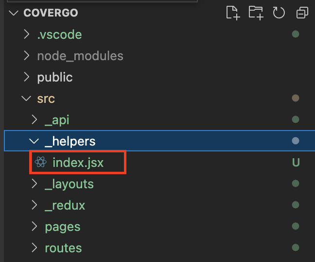

# Getting Started

## View The Project

In the project directory, you can run:

### `yarn start or npm run start`

Runs the app in the development mode.\
Open [http://localhost:3000](http://localhost:3000) to view it in your browser.

### `Technical`

1. **State management using Redux**
2. **Using latest router**
3. **Using latest react**
4. **Styling using default Tailwind from CRA**

### `Function`

The function can be found at root **_"src/\_helpers/index.jsx"_**

